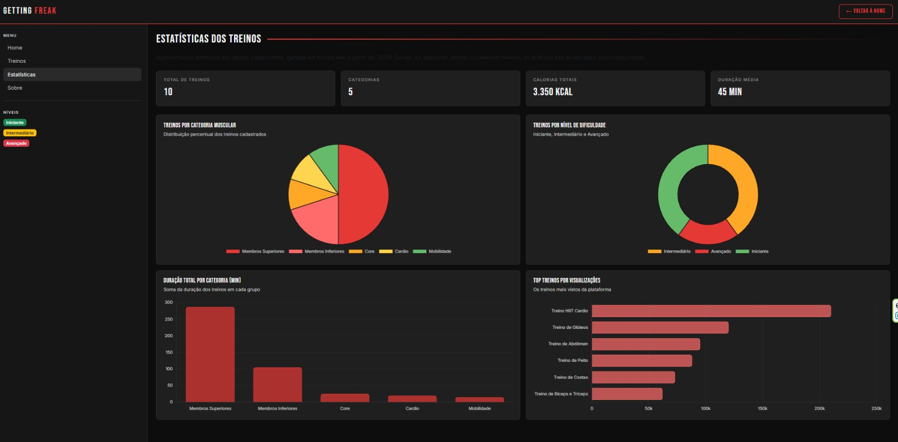

# Trabalho Prático - Semana 14

A partir dos dados que você tem no seu projeto, vamos trabalhar formas de apresentação que representem de forma clara e interativa essas informações. Você poderá usar gráficos (barra, linha, pizza), mapas, calendários ou outras formas de visualização. Seu desafio é entregar uma página Web que organize, processe e exiba os dados de forma compreensível e esteticamente agradável.

Com base nos tipos de projetos escohidos, você deve propor **visualizações que estimulem a interpretação, agrupamento e exibição criativa dos dados**, trabalhando tanto a lógica quanto o design da aplicação.

Sugerimos o uso das seguintes ferramentas acessíveis: [FullCalendar](https://fullcalendar.io/), [Chart.js](https://www.chartjs.org/), [Mapbox](https://docs.mapbox.com/api/), para citar algumas.

## Informações do trabalho

- Nome: João Paulo Ferreira Rodrigues
- Matricula: 908448
- Proposta de projeto escolhida:Getting Freak
- Breve descrição sobre seu projeto:  O site é voltado para compartilhar treinos, dietas e dicas de saúde, além de contar com um blog pessoal para dividir experiências e atualizações do dia a dia.

**Print da tela com a implementação**

<< Coloque aqui uma breve explicação da implementação feita nessa etapa>>
Foi adicionada uma página de estatísticas que consome a API do JSON Server e apresenta os dados em quatro gráficos dinâmicos com a biblioteca Chart.js: pizza de treinos por categoria muscular, rosca por nível de dificuldade, barras verticais de duração total por categoria e barras horizontais com o ranking de visualizações. Um resumo numérico no topo. Como tudo parte da API, alterações feitas via CRUD na etapa anterior são refletidas automaticamente nos gráficos.

<<  COLOQUE A IMAGEM TELA 1 AQUI >>

<<  COLOQUE A IMAGEM TELA 2 AQUI >>